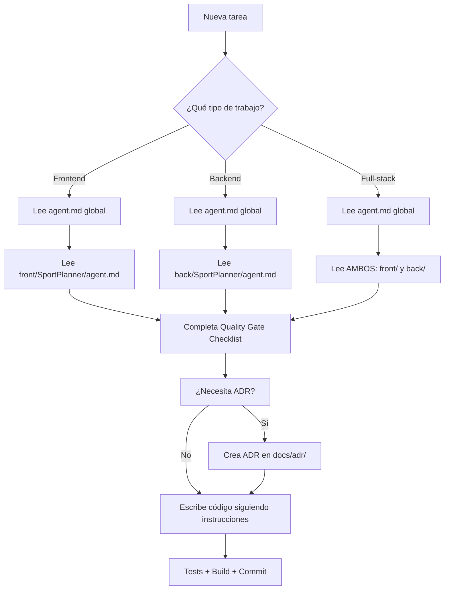

# Claude Code - Agent Instructions

Este proyecto utiliza archivos de instrucciones para agentes de IA para mantener la calidad y consistencia del código.

## 📂 Estructura de Instrucciones

El proyecto tiene **instrucciones en capas** para guiar el desarrollo:

```
src/
├── agent.md                          # ✅ Instrucciones GLOBALES (todo el proyecto)
│   ├── Principios arquitectónicos
│   ├── Estándares de seguridad
│   ├── Convenciones de nombres
│   ├── Quality gate checklist
│   └── Referencias a ADRs
│
├── front/SportPlanner/agent.md       # 🎨 Instrucciones FRONTEND (solo Angular/Tailwind)
│   ├── Angular 20 standalone components
│   ├── Signals & reactive state
│   ├── Tailwind CSS (NO Angular Material)
│   ├── Supabase auth frontend
│   └── Testing con Jasmine/Karma
│
└── back/SportPlanner/agent.md        # ⚙️ Instrucciones BACKEND (solo .NET/EF Core)
    ├── Clean Architecture (.NET 8)
    ├── MediatR CQRS pattern
    ├── Entity Framework Core
    ├── Supabase JWT validation
    └── Testing con xUnit/Moq
```

---

## 🎯 Cómo Usar Estas Instrucciones

### 1. **Siempre Empieza por `agent.md` (Global)**
   - Lee primero **[agent.md](agent.md)** para entender:
     - Arquitectura general del proyecto
     - Estándares de seguridad (JWT, secrets, HTTPS)
     - Convenciones de nombres (archivos, clases, variables)
     - Quality gate checklist (MANDATORY antes de codificar)

### 2. **Frontend → Lee `front/SportPlanner/agent.md`**
   - Si trabajas en **Angular/TypeScript**, lee **[front/SportPlanner/agent.md](front/SportPlanner/agent.md)**
   - Contiene:
     - Patrones de componentes standalone
     - Uso de Signals (NO BehaviorSubject para estado primario)
     - Librería de componentes Tailwind (NO Angular Material)
     - Autenticación con Supabase cliente
     - Testing frontend específico

### 3. **Backend → Lee `back/SportPlanner/agent.md`**
   - Si trabajas en **.NET/C#**, lee **[back/SportPlanner/agent.md](back/SportPlanner/agent.md)**
   - Contiene:
     - Clean Architecture (Domain → Application → Infrastructure → API)
     - MediatR Commands/Queries (CQRS)
     - Entity Framework Core (repositorios, migraciones)
     - Validación con FluentValidation
     - Testing backend específico

### 4. **Consulta ADRs para Decisiones Arquitectónicas**
   - Revisa `docs/adr/` antes de tomar decisiones arquitectónicas importantes
   - **NUNCA modifiques ADRs sin aprobación humana**

---

## ⚡ Flujo de Trabajo Recomendado



---

## 🚨 Reglas Críticas

### **ANTES de escribir código:**
1. ✅ Lee **[agent.md](agent.md)** (instrucciones globales)
2. ✅ Lee el archivo específico:
   - Frontend: **[front/SportPlanner/agent.md](front/SportPlanner/agent.md)**
   - Backend: **[back/SportPlanner/agent.md](back/SportPlanner/agent.md)**
3. ✅ Completa el **Quality Gate Checklist** de [agent.md](agent.md)
4. ✅ Revisa `docs/adr/` si afecta arquitectura

### **NO toques sin aprobación:**
- ❌ `agent.md`, `front/agent.md`, `back/agent.md` (reglas de calidad)
- ❌ `docs/adr/**` (decisiones arquitectónicas)
- ❌ `.husky/**` (git hooks)
- ❌ `.github/workflows/**` (CI/CD)

---

## 📋 Checklist Rápido

**Para cualquier cambio:**
- [ ] Leí **[agent.md](agent.md)** (global)
- [ ] Leí archivo específico (front o back según corresponda)
- [ ] Completé Quality Gate Checklist
- [ ] Revisé ADRs relacionados
- [ ] Seguí convenciones de nombres
- [ ] Apliqué estándares de seguridad
- [ ] Tests escritos/actualizados
- [ ] Build pasa sin errores

---

## 🚀 Comandos Rápidos

### Iniciar/Reiniciar Servicios de Desarrollo

**Comando slash (recomendado):**
```
/start
```

**Scripts directos:**
```powershell
# Windows (PowerShell)
./scripts/restart-services.ps1

# Linux/macOS (Bash)
./scripts/restart-services.sh
```

**Lo que hace automáticamente:**
1. ✋ Detiene procesos existentes (node, dotnet)
2. 🧹 Libera puertos (4200, 5000, 5001)
3. 🎨 Inicia Angular en http://localhost:4200
4. ⚙️ Inicia .NET en https://localhost:5001
5. ✅ Verifica que ambos servicios responden

**Resultado:**
- **Frontend:** http://localhost:4200
- **Backend:** https://localhost:5001
- Windows: Ventanas separadas para cada servicio
- Linux/macOS: Logs en `/tmp/angular-dev.log` y `/tmp/dotnet-api.log`

---

## 🔗 Enlaces Rápidos

| Archivo | Ubicación | Cuándo Usar |
|---------|-----------|-------------|
| **Global** | [agent.md](agent.md) | SIEMPRE (antes de cualquier cambio) |
| **Frontend** | [front/SportPlanner/agent.md](front/SportPlanner/agent.md) | Trabajando en Angular/Tailwind |
| **Backend** | [back/SportPlanner/agent.md](back/SportPlanner/agent.md) | Trabajando en .NET/EF Core |
| **ADRs** | [docs/adr/](docs/adr/) | Decisiones arquitectónicas |
| **Scripts** | [scripts/](scripts/) | Automatización (restart-services) |

---

## 💡 Ejemplo de Uso

**Escenario: Crear nueva feature de "Training Plans"**

1. **Lee [agent.md](agent.md)** → Entiendes arquitectura, seguridad, naming
2. **¿Frontend o Backend?** → Ambos
3. **Lee [front/SportPlanner/agent.md](front/SportPlanner/agent.md)** → Patrones Angular, Signals, Tailwind
4. **Lee [back/SportPlanner/agent.md](back/SportPlanner/agent.md)** → Clean Architecture, MediatR, EF Core
5. **Completa Quality Gate** → Checklist de [agent.md](agent.md)
6. **¿Necesita ADR?** → Sí (nueva feature importante) → Crea `docs/adr/ADR-XXX-training-plans.md`
7. **Implementa** siguiendo las 3 guías
8. **Tests + Build** → Commit

---

## 🛠️ Mantenimiento

- **Actualizar instrucciones**: Solo con aprobación del equipo
- **Versión actual**: 2.0 (Consolidado, auto-contenido)
- **Última actualización**: 2025-10-06

---

**Recuerda**: Estas instrucciones existen para mantener calidad y consistencia. Úsalas como guía, no como restricción.
