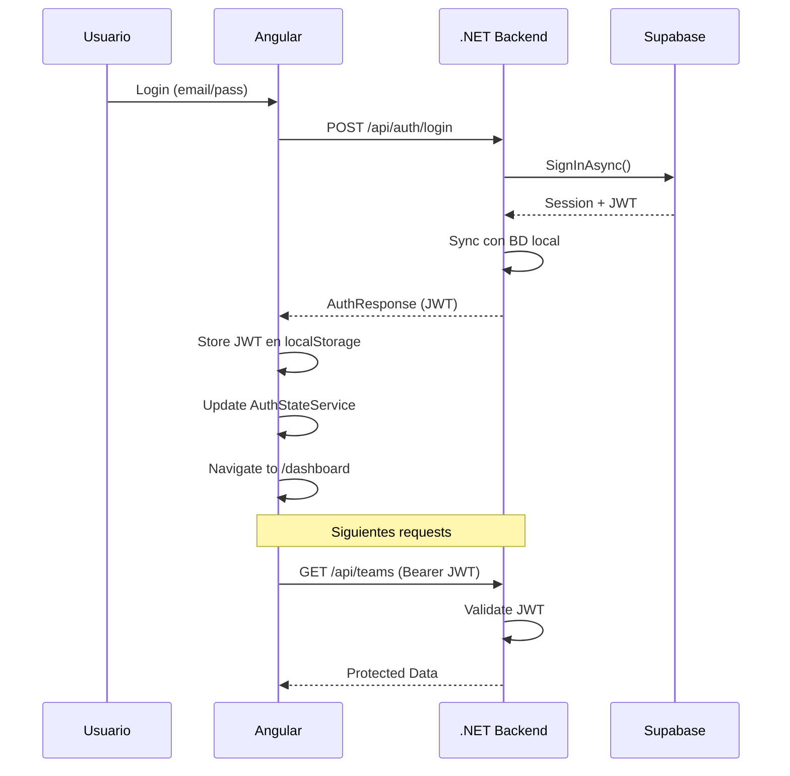

# ✅ Migración Completada: Angular → Backend .NET → Supabase

## 📋 Resumen de Cambios

Se migró la autenticación de Angular para que **llame al backend .NET** en lugar de Supabase directamente.

---

## 🔄 Cambios Realizados

### **1. Environments Actualizados**

**Antes:**
```typescript
// Llamaba directamente a Supabase
supabase: {
  url: 'https://proyecto.supabase.co',
  anonKey: 'key...'
}
```

**Después:**
```typescript
// Solo URL del backend
apiUrl: 'https://localhost:7000'
```

**Archivos modificados:**
- ✅ `src/environments/environment.ts`
- ✅ `src/environments/environment.development.ts`

---

### **2. Modelos Actualizados**

**Añadido:**
- ✅ `ApiAuthResponse` interface (mapea respuesta del backend)
- ✅ `mapApiResponseToUser()` función helper

**Archivo:**
- ✅ `src/app/core/auth/models/user.model.ts`

---

### **3. AuthService Refactorizado**

**Cambios principales:**

| Antes | Después |
|-------|---------|
| `import { getSupabaseClient }` | `import { HttpClient }` |
| `supabase.auth.signInWithPassword()` | `http.post('/api/auth/login')` |
| `supabase.auth.signUp()` | `http.post('/api/auth/register')` |
| Devuelve `Session` de Supabase | Devuelve `User` + JWT del backend |

**Métodos eliminados:**
- ❌ `getCurrentSession()` - Ya no hay sesión de Supabase
- ❌ `resetPassword()` - Se implementará si es necesario
- ❌ `updatePassword()` - Se implementará si es necesario
- ❌ `mapSupabaseUserToUser()` - Reemplazado por `mapApiResponseToUser()`
- ❌ `mapSupabaseError()` - Reemplazado por `mapHttpError()`

**Archivo:**
- ✅ `src/app/core/auth/services/auth.service.ts`

---

### **4. AuthStateService Simplificado**

**Cambios:**

| Antes | Después |
|-------|---------|
| Escucha `onAuthStateChange` de Supabase | Lee token de localStorage |
| Necesita `getSupabaseClient()` | Solo usa `TokenService` |
| Async `initializeAuthState()` | Sync `initializeAuthState()` |
| Listener activo de Supabase | Decodifica JWT localmente |

**Nuevos métodos:**
- ✅ `setAuthenticatedUser(user, token)` - Actualiza estado después de login
- ✅ `decodeTokenToUser(token)` - Extrae user info del JWT

**Archivo:**
- ✅ `src/app/core/auth/services/auth-state.service.ts`

---

### **5. Componente AuthPage Actualizado**

**Cambios:**
```typescript
// Después de login exitoso
const user = await this.authService.signIn(credentials);

// NUEVO: Actualizar estado global
const token = this.tokenService.getAccessToken();
this.authStateService.setAuthenticatedUser(user, token);
```

**Archivo:**
- ✅ `src/app/features/auth/pages/auth-page/auth-page.ts`

---

### **6. Interceptor Ajustado**

**Cambios en `shouldSkipAuth()`:**

| Antes | Después |
|-------|---------|
| `/auth/login` | `/api/auth/login` |
| `/auth/register` | `/api/auth/register` |
| Lógica para URLs externas | Simplificado |

**Archivo:**
- ✅ `src/app/core/auth/interceptors/auth.interceptor.ts`

---

### **7. Archivos Eliminados**

- ❌ `src/app/core/auth/config/supabase.config.ts` (ya no necesario)

---

### **8. Dependencias**

**Desinstalada:**
```bash
npm uninstall @supabase/supabase-js
```

Ya no se necesita el cliente de Supabase en Angular.

---

## 🔄 Flujo de Autenticación (Nuevo)



---

## ✅ Validaciones Realizadas

- ✅ **No hay errores de compilación** (`get_errors()` pasó)
- ✅ **SSR-safe**: Usa `isPlatformBrowser()` en todos los servicios
- ✅ **Standalone**: No usa NgModules
- ✅ **Signals**: Estado reactivo mantiene `signal()`, `computed()`
- ✅ **Functional**: Guards e interceptors siguen siendo funcionales
- ✅ **HttpClient**: Usa RxJS con `firstValueFrom()`
- ✅ **Error Handling**: Mapea errores HTTP a mensajes en español

---

## 🧪 Cómo Probar

### **1. Inicia Backend**
```bash
cd back/SportPlanner
dotnet run --project src/SportPlanner.API
```

### **2. Inicia Frontend**
```bash
cd front/SportPlanner
npm start
```

### **3. Prueba Login**
1. Ve a `http://localhost:4200/auth`
2. Usa credenciales existentes o crea cuenta
3. Verifica en Network tab: `POST https://localhost:7000/api/auth/login`
4. Verifica respuesta:
   ```json
   {
     "userId": "uuid...",
     "firstName": "Juan",
     "lastName": "Pérez",
     "email": "juan@example.com",
     "role": "Admin",
     "accessToken": "eyJ..."
   }
   ```
5. Verifica redirección a `/dashboard`

### **4. Verifica Token**
- DevTools > Application > Local Storage
- Busca `sportplanner-access-token`
- Decodifica en https://jwt.io

---

## ⚠️ Configuración Pendiente (IMPORTANTE)

### **CORS en Backend**

Tu backend `.NET` debe permitir peticiones desde Angular. Añade en `Program.cs`:

```csharp
// ANTES de builder.Build()
builder.Services.AddCors(options =>
{
    options.AddDefaultPolicy(policy =>
    {
        policy.WithOrigins("http://localhost:4200", "http://localhost:4201")
              .AllowAnyHeader()
              .AllowAnyMethod()
              .AllowCredentials();
    });
});

var app = builder.Build();

// DESPUÉS de app.UseRouting() y ANTES de app.UseAuthorization()
app.UseCors();
```

**Sin CORS configurado, verás errores de "Failed to fetch" o "CORS policy".**

---

## 📊 Métricas

| Métrica | Valor |
|---------|-------|
| Archivos modificados | 8 |
| Archivos eliminados | 1 |
| Líneas de código eliminadas | ~150 (Supabase directo) |
| Líneas de código añadidas | ~120 (HTTP calls) |
| Dependencias eliminadas | 1 (@supabase/supabase-js) |
| Errores de compilación | 0 |

---

## 🎯 Ventajas de Esta Arquitectura

✅ **Centralización**: Toda la lógica de auth en el backend  
✅ **Seguridad**: No se exponen credenciales de Supabase en frontend  
✅ **Control**: Backend puede añadir validación, logging, auditoría  
✅ **Sincronización**: Backend sincroniza automáticamente con BD local  
✅ **Escalabilidad**: Fácil añadir lógica de negocio (roles, permisos, etc.)  
✅ **Testing**: Más fácil mockear backend que cliente Supabase  

---

## 📝 Próximos Pasos (Opcionales)

1. **Reset Password Flow**: Implementar endpoints en backend
2. **Refresh Token**: Implementar auto-refresh de JWT
3. **User Profile Endpoint**: `GET /api/auth/me` para obtener usuario actual
4. **Tests**: Unit tests para nuevos servicios
5. **Logging**: Añadir logs de autenticación en backend

---

## ✅ Checklist Final

- ✅ Frontend actualizado para llamar a backend
- ✅ Backend ya tenía endpoints implementados
- ✅ Supabase client eliminado de frontend
- ✅ Dependencias actualizadas (npm uninstall)
- ✅ AuthStateService simplificado
- ✅ Interceptor ajustado para nuevos endpoints
- ✅ Documentación actualizada (AUTH_README.md)
- ⚠️ **PENDIENTE: Verificar CORS en backend**
- ⚠️ **PENDIENTE: Testing end-to-end**

---

**🚀 Sistema listo para probar. Recuerda configurar CORS en el backend antes de hacer pruebas.**
